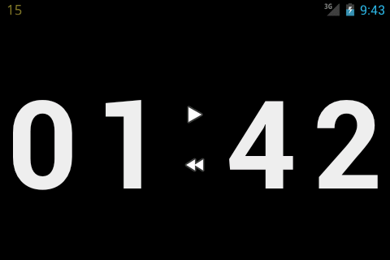
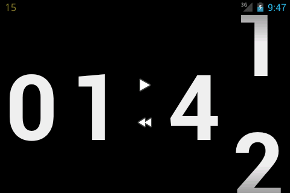
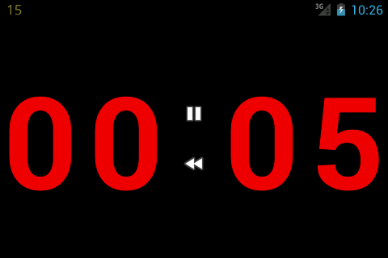

Countdown Timer
===============

Simple countdown timer for Android.

Uses [android-spinnerwheel](https://github.com/ai212983/android-spinnerwheel) component to display animated counter-wheels.

How to use
----------

* Set up the initial timer value
* Start/Stop the timer
* Rewind back to the initial value

Downloads
---------

* [Google Play](https://play.google.com/store/apps/details?id=ru.gelin.android.countdown)
* [GitHub](https://github.com/gelin/countdown-timer/releases)

Demo
----

Screenshots
-----------

License
-------

This program is free software: you can redistribute it and/or modify
it under the terms of the GNU General Public License as published by
the Free Software Foundation, either version 3 of the License, or
(at your option) any later version.

This program is distributed in the hope that it will be useful,
but WITHOUT ANY WARRANTY; without even the implied warranty of
MERCHANTABILITY or FITNESS FOR A PARTICULAR PURPOSE.  See the
GNU General Public License for more details.

You should have received a copy of the GNU General Public License
along with this program.  If not, see <http://www.gnu.org/licenses/>.
